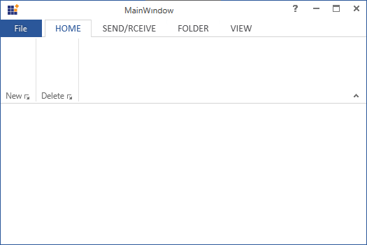

# How-to-access-the-help-button-in-WPF-Ribbon
This repository contains the sample that how to access the help button in WPF Ribbon

The help button in our WPF Ribbon control is used to show the notification or migrate to the desired help links as the same behavior exist in MS file explorer. 

The help button can be shown in our WPF Ribbon control by enabling the ShowHelpButton. Refer the below code for your reference.

The functionality of help button can be handled based on your requirement by invoking the click event of TitleBarButton template. Refer the below code for your reference.

```XAML
<syncfusion:WindowTitleBarButton
       x:Name="HelpButton"
       Width="29"
       Height="22"
       Click="HelpButton_Click_1"
       Style="{StaticResource HelpButtonStyle}"
       Visibility="{Binding RelativeSource={RelativeSource FindAncestor, AncestorType={x:Type syncfusion:RibbonWindow}}, Path=ShowHelpButton, Converter={StaticResource BooleanToVisibilityConverter}}" />
```

```C#
private void HelpButton_Click_1(object sender, RoutedEventArgs e)
{
   //navigate to url link
   System.Diagnostics.Process.Start("https://help.syncfusion.com/wpf/welcome-to-syncfusion-essential-wpf");
}
```

Output:


